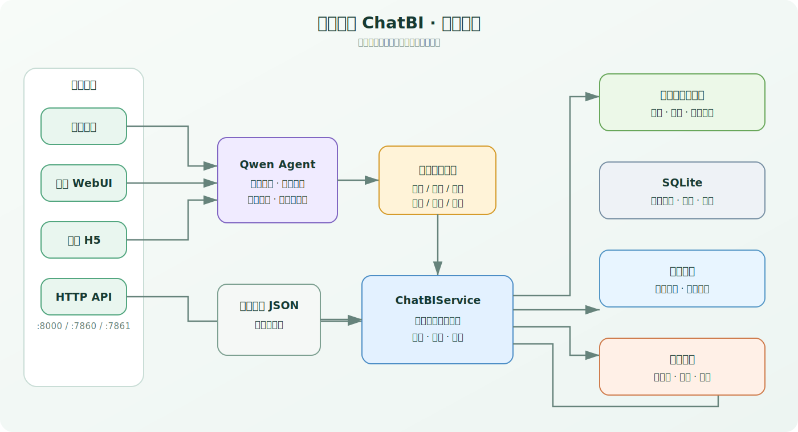
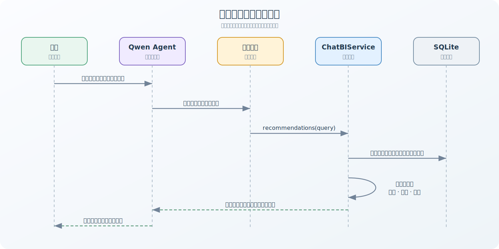

# 成都徒步 ChatBI

一个面向成都周边徒步场景的自然语言路线咨询与推荐系统。项目以人工审核的结构化路线为事实基础，由 Qwen Agent 理解用户需求，并通过受控工具完成路线筛选、交通与天气估算、停车点查询、报团链接检索和行程费用计算。

## 核心能力

- 自然语言对话：支持终端、桌面 WebUI 和移动端 H5。
- 路线推荐：按距离、爬升、难度、预算、时长、风景和交通容忍度筛选排序。
- 行程辅助：估算往返交通、费用、返回时间，并识别穿越线接驳需求。
- 天气与日期：查询和风天气预警/逐日天气，解析“本周末”“下周三”等中文日期。
- 自驾与报团：展示已审核停车点、高德导航链接及多个商团来源的活动链接。
- 数据闭环：支持路线 JSON 导入、SQLite 持久化和实际行程反馈。
- 数据采集：提供游侠客路线采集、AI 结构化和停车点候选补全工具。

## 系统架构



项目刻意将“模型理解”和“业务事实”分开：模型负责理解、追问和组织答案；路线、费用、天气等结果必须由受控工具和服务层产生，Agent 不执行任意 SQL，也不直接修改业务数据。

### 一次推荐的主要数据流



## 技术栈

- Python 3.11
- SQLite
- Qwen Agent / DashScope
- Gradio WebUI 与独立 H5 页面
- Python `ThreadingHTTPServer`
- Playwright（路线采集）
- Docker / Docker Compose
- `unittest` 测试体系

## 目录结构

```text
.
├── hiking_chatbi/          # 核心业务、API、Agent 工具与采集管道
│   ├── __main__.py         # 命令行入口
│   ├── qwen_chatbi.py      # Agent、工具定义和 UI 启动
│   ├── service.py          # 统一业务服务门面
│   ├── recommend.py        # 推荐、费用与行程时间计算
│   ├── db.py               # SQLite 表结构和数据访问
│   ├── weather.py          # 天气预警和逐日天气 Provider
│   ├── traffic.py          # 实时/历史交通估算
│   └── *_collector.py      # 路线采集和数据补全
├── qwen_agent/             # 内置 Qwen Agent 与定制 UI 基础层
├── data/                   # 样例路线、节假日和采集结果
├── spec/                   # 已实现需求与设计规格
│   └── archived/           # 已废弃、搁置或大幅变更的规格
├── test/                   # unittest 测试（test_*.py）
├── .env.example            # 完整环境变量模板
├── Dockerfile
└── compose.yaml
```

## 快速开始

### 1. 本地运行

建议使用 Python 3.11。首次运行需要安装项目已锁定的依赖：

```powershell
python -m venv .venv
.venv\Scripts\Activate.ps1
python -m pip install -r requirements.txt
playwright install chromium
Copy-Item .env.example .env
```

编辑 `.env`，至少填写：

```dotenv
DASHSCOPE_API_KEY=你的_DashScope_API_Key
```

如需真实天气，再填写 `QWEATHER_API_KEY` 和正确的 `QWEATHER_API_HOST`。随后一键启动 API、WebUI 和 H5：

```powershell
python -m hiking_chatbi app
```

启动后访问：

| 服务 | 地址 | 用途 |
| --- | --- | --- |
| HTTP API | <http://127.0.0.1:8000> | 程序化查询与导入 |
| WebUI | <http://127.0.0.1:7860> | 桌面端对话 |
| H5 | <http://127.0.0.1:7861> | 移动端对话 |

应用启动时只初始化数据库表结构，不会自动导入或同步 `data/sample_routes.json`。需要载入样例路线时，
请显式执行 `python -m hiking_chatbi init`；也可以使用 `import <path>` 手工导入其他路线文件。

### 2. Docker 运行

```powershell
Copy-Item .env.example .env
# 编辑 .env，填写所需密钥
docker compose up --build -d
docker compose logs -f chatbi
docker compose logs -f route-scheduler
```

停止服务：

```powershell
docker compose down
```

Compose 会同时启动主应用 `chatbi` 和每日路线调度服务 `route-scheduler`。在 `.env` 中配置：

```dotenv
CHATBI_ROUTE_SCHEDULE_TIME=18:21
CHATBI_ROUTE_SCHEDULE_COUNT=1
```

调度服务会在每天北京时间 18:21 重新抓取并更新 1 条路线；完整校验更新后的
`sample_routes.json` 后，会将路线增量导入主应用使用的 `chatbi.db`。修改参数后运行
`docker compose up -d` 重新创建服务即可。

Compose 使用 `chatbi-runtime` 保存数据库和调度日志，使用 `chatbi-data` 让两个容器共享
`/app/data/sample_routes.json`。普通重建或 `docker compose down` 不会删除命名卷；
`docker compose down --volumes` 会删除数据库和共享路线文件，请谨慎执行。

## 命令行入口

```powershell
python -m hiking_chatbi init
python -m hiking_chatbi serve
python -m hiking_chatbi import data/sample_routes.json
python -m hiking_chatbi qwen-chat
python -m hiking_chatbi qwen-web
python -m hiking_chatbi qwen-h5
python -m hiking_chatbi app
```

| 命令 | 说明 |
| --- | --- |
| `init` | 初始化数据库并导入样例路线 |
| `serve` | 只启动 HTTP API |
| `import <path>` | 校验并导入结构化路线 JSON |
| `qwen-chat` | 启动终端连续对话 |
| `qwen-web` | 只启动桌面 WebUI |
| `qwen-h5` | 只启动移动端 H5 |
| `app` | 同时启动 API、WebUI 和 H5 |

游侠客成都一日徒步路线采集使用独立模块，并且必须显式指定本次需要的路线数量：

```powershell
python -m hiking_chatbi.youxiake_route_pipeline --count 20
```

流水线按网站展示顺序筛选合格路线，使用 `qwen3.7-max` 联网补全，并将结果增量合并后同步写入
`data/sample_routes_select.json` 与 `data/sample_routes.json`。运行前必须配置 `DASHSCOPE_API_KEY`；
采集失败或最终校验失败不会改动这两个正式文件。

如需由常驻 Python 进程每天定时更新 10 条路线，例如每天北京时间 03:00 执行：

```powershell
python -m hiking_chatbi.youxiake_route_scheduler --time 03:00 --count 10
```

加上 `--run-now` 会在调度器启动后立即执行一次，然后继续等待每日时间点。调度器必须保持运行；按 `Ctrl+C`
可正常退出。每次任务都会带 `--refresh-links` 重新读取网站，默认日志保存在
`data/youxiake_route_scheduler.log`。

## 配置

完整配置及默认值见 [`.env.example`](.env.example)。常用配置如下：

| 环境变量 | 默认值 | 说明 |
| --- | --- | --- |
| `CHATBI_DB_PATH` | `data/chatbi.db` | SQLite 数据库路径 |
| `CHATBI_SAMPLE_DATA_PATH` | `data/sample_routes.json` | 执行 `init` 时导入的数据文件 |
| `CHATBI_HOST` / `CHATBI_PORT` | `127.0.0.1` / `8000` | API 监听地址 |
| `CHATBI_WEB_HOST` / `CHATBI_WEB_PORT` | `127.0.0.1` / `7860` | WebUI 监听地址 |
| `CHATBI_H5_HOST` / `CHATBI_H5_PORT` | `127.0.0.1` / `7861` | H5 监听地址 |
| `DASHSCOPE_API_KEY` | 无 | Qwen 对话与 AI 采集所需 |
| `CHATBI_QWEN_MODEL` | `qwen-max` | 对话模型 |
| `CHATBI_TRAFFIC_PROVIDER` | `none` | `none` 或用于演示的 `mock` |
| `CHATBI_ALERT_PROVIDER` | `qweather` | `qweather`、`mock` 或 `none` |
| `QWEATHER_API_KEY` | 无 | 和风天气 API Key |
| `CHATBI_LOG_LEVEL` | `INFO` | 项目日志级别 |

不要提交 `.env`、真实密钥或本地数据库。

## HTTP API

所有接口使用 JSON；当前服务未提供鉴权、限流和分页，不应未经加固直接暴露到公网。

| 方法 | 路径 | 作用 |
| --- | --- | --- |
| `GET` | `/health` | 健康检查 |
| `GET` | `/routes` | 查询已审核路线 |
| `POST` | `/recommendations` | 按结构化条件推荐路线 |
| `POST` | `/traffic/estimate` | 估算指定路线交通 |
| `POST` | `/weather/estimate` | 查询路线天气与预警 |
| `POST` | `/routes/import` | 导入路线数据 |
| `POST` | `/feedback/trips` | 记录实际行程反馈 |

推荐示例：

```powershell
$body = @{
  departure_at = "2026-07-11T06:30:00+08:00"
  max_distance_km = 12
  max_ascent_m = 800
  max_difficulty = "moderate"
  scenery_preferences = @("森林", "草甸")
} | ConvertTo-Json

Invoke-RestMethod `
  -Method Post `
  -Uri http://127.0.0.1:8000/recommendations `
  -ContentType "application/json" `
  -Body $body
```

更完整的字段、返回结构、评分与交通估算规则见 [`spec/README.md`](spec/README.md)。

## 数据与业务边界

SQLite 主要保存以下实体：

- `routes`：路线基本信息、设施、风险、来源和审核状态。
- `route_parking_points`：人工审核停车点及坐标。
- `traffic_profiles`：基础车程、时段增量和常见拥堵点。
- `route_cost_items`：门票、中转车、停车等路线费用。
- `transport_cost_items`：燃油、过路费、车票等交通费用。
- `trip_feedback`：实际交通耗时和拥堵反馈。

对外列表和推荐只使用 `reviewed = true` 的路线。停车点补全产生的候选默认也不会直接展示，必须人工核验名称、坐标、来源和说明后才可标记为已审核。

### 数据维护原则

1. 普通外部采集结果只是候选数据；游侠客统一流水线是经用户确认的例外，会在严格校验后标记为已审核并进入运行文件。
2. 导入前完成字段校验与人工审核。
3. 其他结构化路线通过 `python -m hiking_chatbi import <path>` 导入。
4. 修改 `data/sample_routes.json` 只会影响后续显式执行 `init` 时导入数据库的数据。
5. 生产反馈或自行维护的数据需要单独备份，不应只依赖容器卷。

采集管道、停车点补全和各平台链接规则分别记录在 `spec/youxiake_route_pipeline.md`、`spec/qwen_parking_points_enrichment.md` 和相关规格中。

## 测试与开发

运行全部测试：

```powershell
python -m unittest discover -s test -p "test_*.py" -v
```

项目遵循“先写 spec、再写测试、最后实现”的流程：

1. 新需求或接口先在 `spec/` 新建独立规格。
2. 在 `test/` 添加中文测试用例，并确保失败时输出异常信息。
3. 最后修改实现，公共函数提供完整类型签名。
4. 修改既有行为时同步更新规格与测试。

详细约束见 [`AGENTS.md`](AGENTS.md)。

## 部署与 CI

`Dockerfile` 构建 Linux `amd64` 镜像，默认命令为：

```text
python -m hiking_chatbi app
```

推送到 `main` 后，GitHub Actions 会运行测试并构建 GHCR 镜像：

```text
ghcr.io/gancg/chengdu-hiking-chatbi
```

生产部署建议固定使用 `sha-<短提交号>` 标签，验证后再升级，避免 `latest` 漂移带来的不可预期变更。

## 当前限制

- 这是徒步路线咨询与推荐助手，不是通用 BI 或任意 SQL 查询系统。
- API 暂无用户、权限、鉴权、CORS、限流和数据库迁移机制。
- 实时交通默认关闭；`mock` 仅用于演示，历史估算不等于导航实时路况。
- 天气、商团链接和采集能力依赖外部服务及其可用性。
- 多日路线的住宿、跨日天气、补给和分段行程尚未完整建模。
- 户外环境变化快，出发前仍需核验天气预警、道路管制、景区政策和救援条件。
- 后续可以将两步路的轨迹和放到该推荐助手系统里面，包含明确的轨迹链接，能通过链接打开两步路查看轨迹详细信息。
